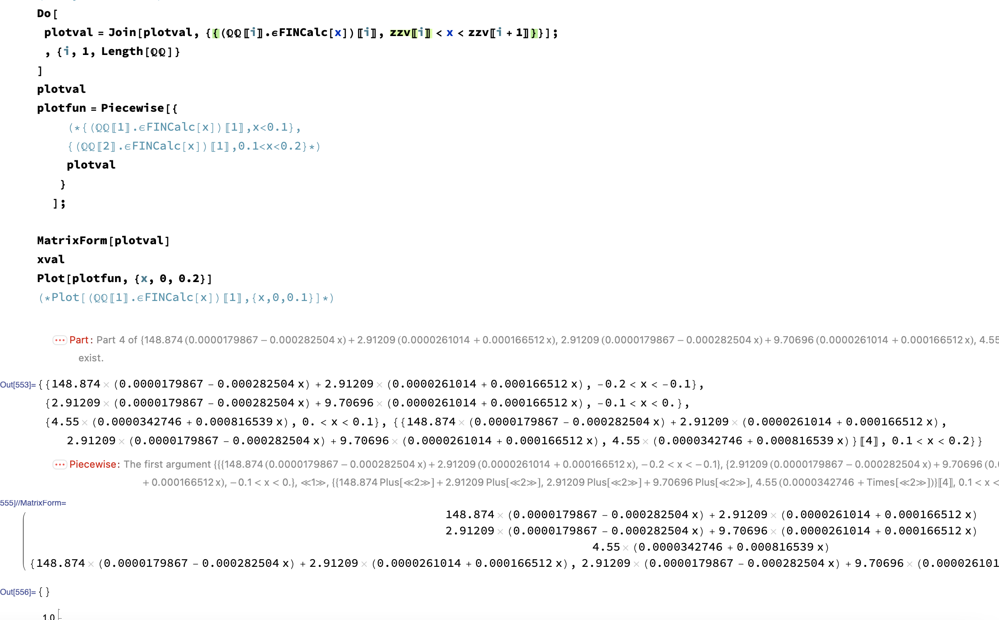

# Stress in thickness

I have to implement:


And obtain:


## Otain stress and curvatures

Compiled function:

```mathematica
PostStrainCurvature[quantity_] := (
   If[quantity == "strain",
    Return[{
      SMTPostData["\[Epsilon]ox", Point[{L/2, H/2, 0}]],
      SMTPostData["\[Epsilon]oy", Point[{L/2, H/2, 0}]], 
      SMTPostData["\[Gamma]oxy"
       , Point[{L/2, H/2, 0}]] 
      }]
    ];
   If[quantity == "curvatures",
    Return[{
      SMTPostData["\[Kappa]x", Point[{L/2, H/2, 0}]] ,
      SMTPostData["\[Kappa]y", Point[{L/2, H/2, 0}]] ,
      SMTPostData["\[Kappa]xy", Point[{L/2, H/2, 0}]] 
      }]
    ];
   );
```


This allow me to extract:

```mathematica
\[Epsilon]post = PostStrainCurvature["strain"]
\[Kappa]post = PostStrainCurvature["curvatures"]
```


## Create $\underline  \varepsilon +z\underline  k$

Simple function:

```mathematica
\[Epsilon]FINCalc[t_] := (
   \[Epsilon]post = PostStrainCurvature["strain"];
   \[Kappa]post = PostStrainCurvature["curvatures"];
   \[Epsilon]FIN = \[Epsilon]post + t \[Kappa]post;
   Return[\[Epsilon]FIN]
   );
```


## Plot 
 
 Like ?


## How to plot ? $σ_x$, $σ_y$ o $σ_{xy}$  ?
SOME PROBLEM: 



### Use `Pieciewise[]`

```mathematica
Do[
 plotval = 
   Join[plotval, {{(\[DoubleStruckCapitalQ]\[DoubleStruckCapitalQ][[
          i]] . \[Epsilon]FINCalc[x])[[1]], 
      zzv[[i]] < x < zzv[[i + 1]]}}];
 , {i, 1, Length[\[DoubleStruckCapitalQ]\[DoubleStruckCapitalQ]]}
 ]
plotfun = Piecewise[plotval
   ];
MatrixForm[plotval]
xval
Plot[plotfun, {x, zzv[[1]], zzv[[Length[zzv]]]}]
```


### Transform into procedure:

```mathematica
plotStress[QQ_, zzv_] := (
   plotval = {};
   Do[
    plotval = 
      Join[
       plotval, {{(\[DoubleStruckCapitalQ]\[DoubleStruckCapitalQ][[
             i]] . \[Epsilon]FINCalc[x])[[1]], 
         zzv[[i]] < x < zzv[[i + 1]]}}];
    , {i, 1, Length[\[DoubleStruckCapitalQ]\[DoubleStruckCapitalQ]]}
    ];
   plotfun = Piecewise[plotval];
   stressGraph = Plot[plotfun, {x, zzv[[1]], zzv[[Length[zzv]]]}];
   Print[stressGraph];
   );
```
### Problem: do not use $ [Q]$ but $[\bar Q]$ 

Update `Do[]`cycle as:
```mathematica
Do[
  plotval = 
    Join[
     plotval, {{((Inverse[\[DoubleStruckCapitalT]\[Sigma][\[Theta]\
\[Theta][[i]]]] . \[DoubleStruckCapitalQ]\[DoubleStruckCapitalQ][[
             i]] . \
\[DoubleStruckCapitalT]\[Epsilon][\[Theta]\[Theta][[
              i]]]) . \[Epsilon]FINCalc[x])[[2]], 
       zzv[[i]] < x < zzv[[i + 1]]}}];
  , {i, 1, Length[\[DoubleStruckCapitalQ]\[DoubleStruckCapitalQ]]}
  ];
```

Now it seem better:


## Final procedure:

```mathematica
plotStress[QQ_, zzv_, \[Theta]\[Theta]_, axis_] := (
   If[axis == "\[Sigma]x", index = 1];
   If[axis == "\[Sigma]y", index = 2];
   If[axis == "\[Tau]xy", index = 3];
   plotval = {};
   plotval1 = {};
   Do[
    plotval = 
      Join[
       plotval, {{((Inverse[\[DoubleStruckCapitalT]\[Sigma][\[Theta]\
\[Theta][[i]]]] . \[DoubleStruckCapitalQ]\[DoubleStruckCapitalQ][[
               i]] . \[DoubleStruckCapitalT]\[Epsilon][\[Theta]\
\[Theta][[i]]]) . \[Epsilon]FINCalc[x])[[index]], 
         zzv[[i]] < x < zzv[[i + 1]]}}];
    , {i, 1, Length[\[DoubleStruckCapitalQ]\[DoubleStruckCapitalQ]]}
    ];
   Do[
    plotval1 = 
      Join[
       plotval1, {{((Inverse[\[DoubleStruckCapitalT]\[Sigma][\[Theta]\
\[Theta][[i]]]] . \[DoubleStruckCapitalQ]\[DoubleStruckCapitalQ][[
               i]] . \[DoubleStruckCapitalT]\[Epsilon][\[Theta]\
\[Theta][[i]]]) . {1, 1, 1})[[index]], 
         zzv[[i]] < x < zzv[[i + 1]]}}];
    , {i, 1, Length[\[DoubleStruckCapitalQ]\[DoubleStruckCapitalQ]]}
    ];
   plotfun = Piecewise[plotval];
   plotfun1 = Piecewise[plotval1];
   stressGraph = 
    Plot[plotfun, {x, zzv[[1]], zzv[[Length[zzv]]]}, 
     Exclusions -> None, PlotLabel -> axis];
   qgraph1 = 
    Plot[plotfun1, {x, zzv[[1]], zzv[[Length[zzv]]]}, 
     Exclusions -> None, PlotLabel -> "\[DoubleStruckCapitalQ]"];
   epsilongraph1 = 
    Plot[(\[Epsilon]FINCalc[x])[[index]], {x, zzv[[1]], 
      zzv[[Length[zzv]]]}, Exclusions -> None, 
     PlotLabel -> "strain"];  
   Print[stressGraph];
   Print[qgraph1];
   Print[epsilongraph1];
   );
```

