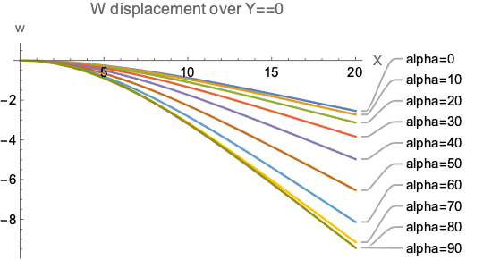
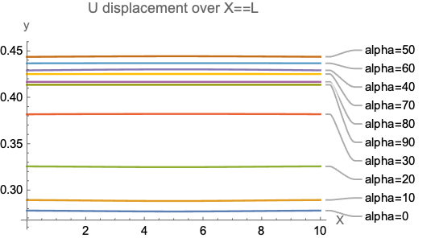
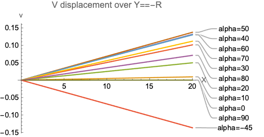
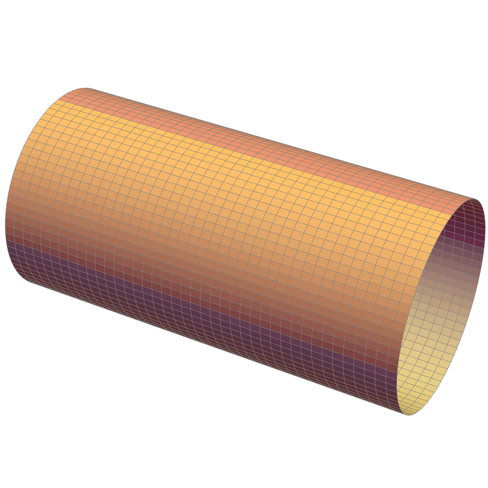
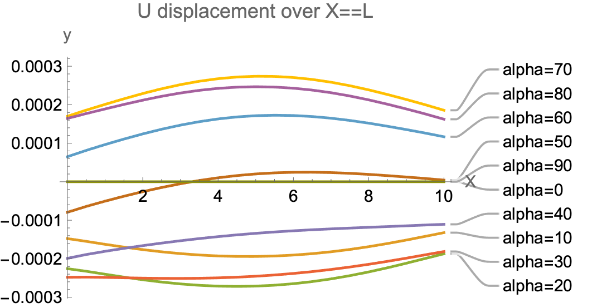
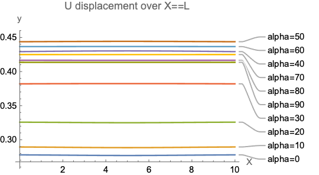
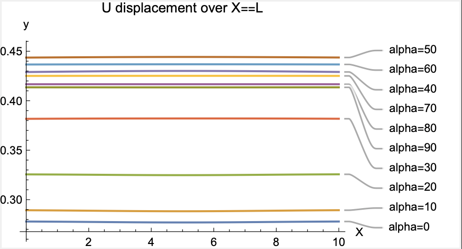

# Obtain single code for test simulation

> 18 dec

Obtained single code for testing $\alpha=\{0,10,20,30,40,50,60,70,80,90\}^\circ$. 

In `first_test.nb`:

Complete code:
```mathematica
SimulationComplete[alpha_] := (
   displacement = Table[{0*i, 0, 0}, {i, 1, Length[alpha]}];
   Do[
    Print["\[Alpha]=", alpha[[i]]];
    MyGeometry[alpha[[i]]];
    	FEMModel[];
	Coordinate[];
    Solution[];
    displacement[[i]] = PostProcessMyDisplacement[alpha[[i]]];
    , {i, 1, Length[alpha]}];
   PrintMyDisplacement[displacement, alpha];
   );

alpha = {0, 10, 20, 30, 40, 50, 60, 70, 80, 90};
SimulationComplete[alpha]
```



Now i divide it into 3 folder to compute:
- Only assial load
- Only transveral load
- Both

⚠️ I need another graph: extension!

First of all:
* [x] Extension graph. Update in `first_test2.nb` (*)
* [x] Compute the same code for the cylinder (**)
* [x] Start to write down report/report ToC (***)

Than I can divide into three folder (only for the plate) + the cylinder ones. (****)

____

## (*)

Update the code by adding in `PostProcessMyDisplacement[]`:
```mathematica
data4 = SMTPostData["ul", Line[{{L, 0, 0}, {L, H, 0}}, 100], 
   "OutputForm" -> "Points"];
nodalpoint4 = Table[0*i, {i, 1, Length[Transpose[data4][[2]]]}];
Do[
  nodalpoint4[[i]] = Transpose[data4][[2, i, 2]];
  , {i, 1, Length[Transpose[data4][[2]]]}];
graph4 = 
  ListLinePlot[Transpose[{nodalpoint4, Transpose[data4][[1]]}], 
   PlotLabel -> "U displacement over X==L", AxesLabel -> {"Y", "u"}];
(*Print[graph3];*)

Export[StringJoin[NotebookDirectory[], "U_Y_alpha=", ToString[alpha], 
   ".pdf"], graph4, "pdf"];
 (*  ... *)
displ4 = Transpose[{nodalpoint4, Transpose[data4][[1]]}];
Return[{displ1, displ2, displ3, displ4}]
```

And into `PrintMyDisplacement[]`:

```mathematica
grafico4 = 
  ListLinePlot[
   Table[displacement[[i, 4]], {i, 1, Length[displacement]}], 
   PlotLabel -> "U displacement over X==L", AxesLabel -> {"X", "y"}, 
   PlotLabels -> 
    Table[
     StringJoin["alpha=", ToString[alpha[[i]]]], {i, 1, 
      Length[alpha]}]];
Print[grafico4];
Export[StringJoin[NotebookDirectory[], "U_Y=", ".pdf"], grafico4, 
  "pdf"];
```



# (**)

Also implemented code for Cylinder like:
```mathematica
CSimulationComplete[alpha_] := (
   displacement = Table[{0*i}, {i, 1, Length[alpha]}];
   Do[
    Print["\[Alpha]=", alpha[[i]]];
    MyGeometryCyl[alpha[[i]]];
    FEMModelCyl[];
    CoordinateCyl[];
    SolutionCyl[];
    displacement[[i]] = PostProcessMyDisplacementCyl[alpha[[i]]];
    , {i, 1, Length[alpha]}];
   CPrintMyDisplacement[displacement, alpha];
   );

alpha = {0, 10, 20, 30, 40, 50, 60, 70, 80, 90, -45};
CSimulationComplete[alpha]
```

Now I read vertical (`w`) displacement for superior and inferior border ($Z=R \:\&\: Z=-R$) and both later (`v`) displacement for later border ($Y=R\:\&\:Y=-R$).
For example:





# (***)
Starting write down report. Copied report template from [bone-homogenization](https://github.com/mastroalex/bone-homogenization) in [report folder](../report). 


# (****)

Divided into 
- Only assial load `first_test/axial_load/first_test_2_axial.nb`
- Only transveral load  `first_test/axial_load/first_test_2_transversal.nb`
- Both (original file) `first_test/first_test_2.nb`.

✅ TEST DONE !

## Transversal load: 



## Axial load:



## Both load:



# Upload file

> 23 dec - Correction from previous debug 

## Correction into `first_test_3.nb`:
  
  - Added $\mathbb T_\epsilon$ into _Material Properties_
  - Substitute $\mathbb Q_{bar}$ into `ABDcomp1[]`.
  - Correction `zzv` into `totalQ[]`:

From:
```mathematica
   zzv[[index + j + 1]] = layer[[i, 7]];
```

To

```mathematica
zzv[[index+j+1]]= zzv[[index+j]]+layer[[i,7]];
```

- Upload `zzv` final calculation:

From:

```mathematica
Do[zzv[[k]] = zzv[[k - 1]] + zzv[[k]], {k, 2, Length[zzv]}];
zzv = zzv - (Abs[zzv[[1]] - zzv[[Length[zzv]]]]/2);
Return[{\[DoubleStruckCapitalQ]\[DoubleStruckCapitalQ], 
  zzv, \[Theta]\[Theta]}]
```

To:

```mathematica
zzv = zzv - (Abs[zzv[[1]] + zzv[[Length[zzv]]]]/2);
Return[{\[DoubleStruckCapitalQ]\[DoubleStruckCapitalQ], 
  zzv, \[Theta]\[Theta]}]
```

## Code work -> `first_test_final.nb`

Ad option to use different load conditions:
- Add variabile `axLoad` and `trLoad`.
- Pass it to `SimulationComplete[alpha,axLoad,trLoad]`
- Pass it to `MyGeometry[]`
- Substitute it to `q1` and `q3` value 
- Exporto with different path to clean folder:

```mathematica
If[axLoad == 0, 
 path = StringJoin[NotebookDirectory[], "/transversal_load/"]];
If[trLoad == 0, 
 path = StringJoin[NotebookDirectory[], "/axial_load/"]];
If[axLoad != 0 && trLoad != 0, 
 path = StringJoin[NotebookDirectory[], "/both_load/"]];
 ```

Refine code and save it as `first_test_final.nb`.

## Redone all the test

> All seems ok!

Test done:
- Plate with axial load
- Plate with transversal load
- Plate with both load
- Cylinder

> 24 dec

## Correction for `more_test.nb`

Save file into `more_test2.nb`.

  
  - Added $\mathbb T_\epsilon$ into _Material Properties_
  - Substitute $\mathbb Q_{bar}$ into `ABDcomp1[]`.
  - Correction `zzv` into `totalQ[]`:

From:
```mathematica
   zzv[[index + j + 1]] = layer[[i, 7]];
```

To

```mathematica
zzv[[index+j+1]]= zzv[[index+j]]+layer[[i,7]];
```

- Upload `zzv` final calculation:

From:

```mathematica
Do[zzv[[k]] = zzv[[k - 1]] + zzv[[k]], {k, 2, Length[zzv]}];
zzv = zzv - (Abs[zzv[[1]] - zzv[[Length[zzv]]]]/2);
Return[{\[DoubleStruckCapitalQ]\[DoubleStruckCapitalQ], 
  zzv, \[Theta]\[Theta]}]
```

To:

```mathematica
zzv = zzv - (Abs[zzv[[1]] + zzv[[Length[zzv]]]]/2);
Return[{\[DoubleStruckCapitalQ]\[DoubleStruckCapitalQ], 
  zzv, \[Theta]\[Theta]}]
```

  - Added `PostStrainCurvature[]`and relative function in Post Processing Procedure
    - `εFINCalc[]`
    - `plotStress[]`
  
- Added `plotStress[]` in `SimulationComplete[]`procedure

- Added command for export different load conditions:

```mathematica
If[axLoad == 0, 
 path1 = StringJoin[NotebookDirectory[], "/transversal_load/"]];
If[trLoad == 0, 
 path1 = StringJoin[NotebookDirectory[], "/axial_load/"]];
If[axLoad != 0 && trLoad != 0, 
 path1 = StringJoin[NotebookDirectory[], "/both_load/"]];
path = Table[layer[[j, 2]], {j, 1, Length[layer]}];
(*...*)
Export[path1, "/", 
   ToString[path], "/W_X", ".pdf"], graph1, "pdf"];
```

And export for StressInThickness:
```mathematica
Export[StringJoin[NotebookDirectory[], "/", path1, "stressGraph", "_",
      ToString[axis], ".pdf"], stressGraph, "pdf"];
  Export[
    StringJoin[NotebookDirectory[], "/", path1, "Q", "_", 
     ToString[axis], ".pdf"], qgraph1, "pdf"];
  Export[
    StringJoin[NotebookDirectory[], "/", path1, "epsilon", "_", 
     ToString[axis], ".pdf"], epsilongraph1, "pdf"];
  );
```

## This code not work very well --> Now I use the one from `debug`folder and upload export path.

--> To `more_test3.nb`

✅ Now all works

### Testing mesh refinements to solve $[-30/-45/-30/-45]$ 

Now: 


Into `MyGeometry` set `nmesh`from 20 to 40. Than to 60. 


> 40 could be ok 


Analyze it more depth:

#### Only transversal load:


Reducing load by $10^{-1}$:

Only rescaling


### Only axial load:


## Added `path` also for cylinder simulation

## Clean all code and folder files

--> `more_test.final.nb`.

## Redone all tests

### First of all:
- [x] In plane - out plane 
- [x] Fabric layer 
- [ ] Verify and comment in report couplig (pg 76 Kollar) and matrix form.

