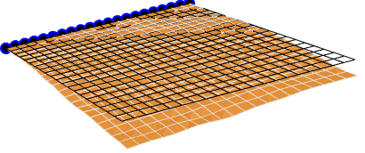

# Starting secondary test

> 19 dec 
> 
## Modify code to generalize testing operation

Update new code for plate and cylinder into `more_test` folder.

- Now the figures are exported to specific folders
- Rifined code

## To Do

- Changed load value (to adapt deformation)

> ⚠️ I have to make changes to apply differential load condition over the plate. 
> IDEA: use `FEMModel[]` to pass text variable like:
> - `AxialLoad->True/False`
> - `TransvLoad->True/False`

* [x] Pass load from `FEMModel[]`
* [ ] Run simulation!

# Update

> 20 dec

##Added post processing code to print deformed mesh:

```mathematica
Print[Show[
   SMTShowMesh["DeformedMesh" -> True, "Mesh" -> GrayLevel[0.9]],
   SMTShowMesh["FillElements" -> False, "BoundaryConditions" -> True, 
    "Mesh" -> GrayLevel[0]]
   ]];
```
!! Added this code also in the `first_test' code.

Ask to prof. what about this deformed mesh ($layer{-30,-45,-30,-45}$):



## Added possibility to control load from out of `FEMModel`:

```mathematica
transvLoad = {2*10^-1* (L/10), 2*10^-3* (L/10)};
axialLoad = {0.02*10^-1, 0};
SimulationComplete[layer, axialLoad, transvLoad];
```

That this variables arrive to `MyGeometry[layer[[i]], axialLoad[[i]], transvLoad[[i]]];` and than inside the procedure:
```mathematica
(*Surface normal load (positive if inward)*)
(*q3=0.02;*) (*force per \
unit area*)
q3 = TransvLoad;

(*Normal load applied on boundary at X=L (positive when aligned with \
global direction X)*)
(*q1=2 t;*) (* (force per unit area)*thickness \
= force per unit length *)
q1 = AxialLoad;
```

## Simulation 


### Plate both load condition

Into principal folder (`more_test`)

### Plate axial load condition

Into `/axial` folder.

### Plate transveral load condition

Into `/transversal` folder.

### Cylinder

Into principal folder (`more_test`)
