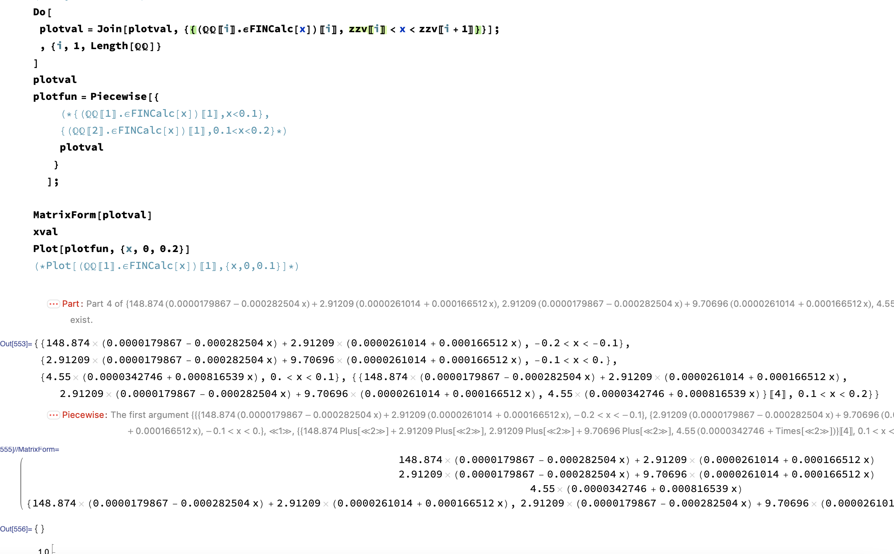

# Stress in thickness

I have to implement:


And obtain:


## Otain stress and curvatures

Compiled function:

```mathematica
PostStrainCurvature[quantity_] := (
   If[quantity == "strain",
    Return[{
      SMTPostData["\[Epsilon]ox", Point[{L/2, H/2, 0}]],
      SMTPostData["\[Epsilon]oy", Point[{L/2, H/2, 0}]], 
      SMTPostData["\[Gamma]oxy"
       , Point[{L/2, H/2, 0}]] 
      }]
    ];
   If[quantity == "curvatures",
    Return[{
      SMTPostData["\[Kappa]x", Point[{L/2, H/2, 0}]] ,
      SMTPostData["\[Kappa]y", Point[{L/2, H/2, 0}]] ,
      SMTPostData["\[Kappa]xy", Point[{L/2, H/2, 0}]] 
      }]
    ];
   );
```


This allow me to extract:

```mathematica
\[Epsilon]post = PostStrainCurvature["strain"]
\[Kappa]post = PostStrainCurvature["curvatures"]
```


## Create $\underline  \varepsilon +z\underline  k$

Simple function:

```mathematica
\[Epsilon]FINCalc[t_] := (
   \[Epsilon]post = PostStrainCurvature["strain"];
   \[Kappa]post = PostStrainCurvature["curvatures"];
   \[Epsilon]FIN = \[Epsilon]post + t \[Kappa]post;
   Return[\[Epsilon]FIN]
   );
```


## Plot 
 
 Like ?


## What to plot ? $σ_x$, $σ_y$ o $σ_{xy}$  ?
SOME PROBLEM: 

