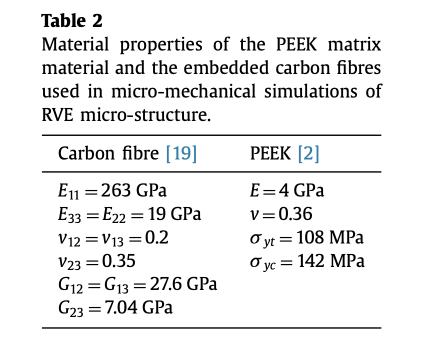
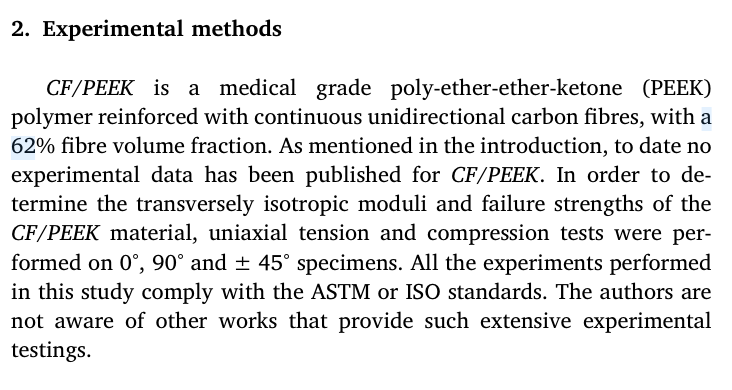
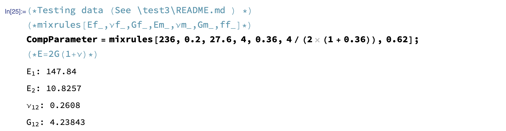

### 17 dec

### Testing mixing rules algorithm for carbon PEEK.
Data from: 

> [Finite element investigation into the use of carbon fibre reinforced PEEK laminated composites for distal radius fracture fixation implants](https://www.sciencedirect.com/science/article/pii/S1350453319300475?via%3Dihub)
> <br>Elizabeth Anne Gallaghera, Steven Lamorinièreb, Patrick McGarrya



Isotropic matrix? Probably.
 $E=2𝐺(1+\nu)$$\longrightarrow G={E\over 2(1+\nu)}$

And from:
> [Multi-axial damage and failure of medical grade carbonfibre reinforcedPEEK laminates: Experimental testing and computational modellin](https://doi.org/10.1016/j.jmbbm.2018.03.015)
> <br>Elizabeth Anne GallagherSteven LamorinièrePatrick McGarr



Report result:
|module|value|
|---|---|
| $E_{11}$  (GPa)| 175.73±5.61 | 
| $E_{22}$  (GPa)| 9.40±0.16   | 
| $G_{12}$   (GPa)| 5.21±0.19   | 
| $\nu_{12}$ | 0.38±0.04   | 

My result:



✅ They should be good results


### Updating mixrules function

```mathematica
(*Print["E1: ", E1, "; E2: ", E2, "; \[Nu]12: ", \[Nu]12, "; G12: ", 
  G12];*)
Print[Subscript["E", "1"], ": ", E1];
Print[Subscript["E", "2"], ": ", E2];
Print[Subscript["\[Nu]", "12"], ": ", \[Nu]12];
Print[Subscript["G", "12"], ": ", G12];
Return[{E1, E2, \[Nu]12, G12}]
```

### CF/PEEK Material

- Italian website [Compositi a base PEEK per uso medicale](https://www.ensingerplastics.com/it-it/semilavorati/biocompatibile-per-uso-medicale/composito-peek-biocompatibile)

Review: 

-  [Developments of PEEK (Polyetheretherketone) as a biomedical material: A focused review](https://www.sciencedirect.com/science/article/pii/S001430572100029X?via%3Dihub) 
  - 
