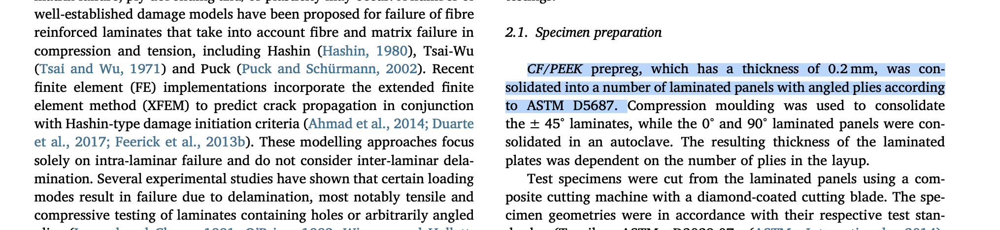
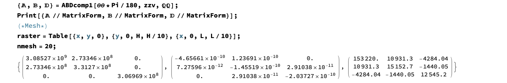
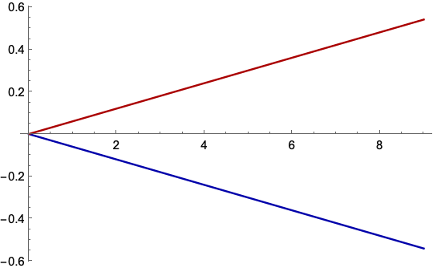
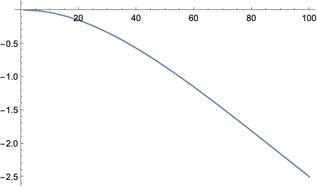
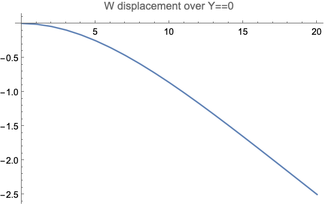

### 18 dec

### Selected layer thickness

Thickness: 0.2 mmm

From:

> [Multi-axial damage and failure of medical grade carbonfibre reinforcedPEEK laminates: Experimental testing and computational modellin](https://doi.org/10.1016/j.jmbbm.2018.03.015)
> <br>Elizabeth Anne GallagherSteven LamorinièrePatrick McGarr



### Unit of measure 

Pa and meters. MPa=$Pa\over mm^2$ so:

```mathematica
CompParameter = 
  mixrules[236*10^3, 0.2, 27.6*10^3, 4*10^3, 0.36, 
   4*10^3/(2 (1 + 0.36)), 0.62];
```


### Corrected `totalQ` calculation

There was an error on index updating. 
Corretion from:
```mathematica
index = layer[[i, 1]];
```

To 
```mathematica
index = index + layer[[i, 1]];
```

### Start test from requesting

- $\left[\alpha/-\alpha/30/-30/0_2\right]s$ with $\alpha\in\left[0^\circ;90^\circ\right]$

```mathematica
EE1 = CompParameter[[1]];
EE2 = CompParameter[[2]];
\[Nu]\[Nu]12 = CompParameter[[3]];
GG12 = CompParameter[[4]];
alpha = 0;
t = 0.0002;
layer = {
   (* n di layer, angolo, E1, E2, \[Nu]12,G12,
   spessore*)
   {1, alpha, EE1, EE2, \[Nu]\[Nu]12, GG12, t},
   {1, -alpha, EE1, EE2, \[Nu]\[Nu]12, GG12, t},
   {1, 30, EE1, EE2, \[Nu]\[Nu]12, GG12, t},
   {1, -30, EE1, EE2, \[Nu]\[Nu]12, GG12, t},
   {2, 0, EE1, EE2, \[Nu]\[Nu]12, GG12, t},
   {2, 0, EE1, EE2, \[Nu]\[Nu]12, GG12, t},
   {1, -30, EE1, EE2, \[Nu]\[Nu]12, GG12, t},
   {1, 30, EE1, EE2, \[Nu]\[Nu]12, GG12, t},
   {1, alpha, EE1, EE2, \[Nu]\[Nu]12, GG12, t},
   {1, -alpha, EE1, EE2, \[Nu]\[Nu]12, GG12, t}
   };
```

Material proprieties was calcuated by `mixrules[]`. 

Different layer properties are in `layer` variable. By passing `layer` to `totalQ` this returns $\mathbb Q\mathbb Q[i],zzv[i],\theta\theta[i]$$ where `i` is the different layer index.  

To test:
```mathematica
{\[DoubleStruckCapitalQ]\[DoubleStruckCapitalQ], 
   zzv, \[Theta]\[Theta]} = 
  total\[DoubleStruckCapitalQ][0, layer, "homogenlayer" -> False];
MatrixForm[\[DoubleStruckCapitalQ]\[DoubleStruckCapitalQ]]
```

For this first test:

$\left(
\begin{array}{ccc}
 \{1.4858\times 10^{11},2.83747\times 10^9,0\} & \{2.83747\times 10^9,1.08799\times 10^{10},0\} & \{0,0,4.23843\times 10^9\} \\
 \{1.4858\times 10^{11},2.83747\times 10^9,0\} & \{2.83747\times 10^9,1.08799\times 10^{10},0\} & \{0,0,4.23843\times 10^9\} \\
 \{1.4858\times 10^{11},2.83747\times 10^9,0\} & \{2.83747\times 10^9,1.08799\times 10^{10},0\} & \{0,0,4.23843\times 10^9\} \\
 \{1.4858\times 10^{11},2.83747\times 10^9,0\} & \{2.83747\times 10^9,1.08799\times 10^{10},0\} & \{0,0,4.23843\times 10^9\} \\
 \{1.4858\times 10^{11},2.83747\times 10^9,0\} & \{2.83747\times 10^9,1.08799\times 10^{10},0\} & \{0,0,4.23843\times 10^9\} \\
 \{1.4858\times 10^{11},2.83747\times 10^9,0\} & \{2.83747\times 10^9,1.08799\times 10^{10},0\} & \{0,0,4.23843\times 10^9\} \\
 \{1.4858\times 10^{11},2.83747\times 10^9,0\} & \{2.83747\times 10^9,1.08799\times 10^{10},0\} & \{0,0,4.23843\times 10^9\} \\
 \{1.4858\times 10^{11},2.83747\times 10^9,0\} & \{2.83747\times 10^9,1.08799\times 10^{10},0\} & \{0,0,4.23843\times 10^9\} \\
 \{1.4858\times 10^{11},2.83747\times 10^9,0\} & \{2.83747\times 10^9,1.08799\times 10^{10},0\} & \{0,0,4.23843\times 10^9\} \\
 \{1.4858\times 10^{11},2.83747\times 10^9,0\} & \{2.83747\times 10^9,1.08799\times 10^{10},0\} & \{0,0,4.23843\times 10^9\} \\
 \{1.4858\times 10^{11},2.83747\times 10^9,0\} & \{2.83747\times 10^9,1.08799\times 10^{10},0\} & \{0,0,4.23843\times 10^9\} \\
 \{1.4858\times 10^{11},2.83747\times 10^9,0\} & \{2.83747\times 10^9,1.08799\times 10^{10},0\} & \{0,0,4.23843\times 10^9\} \\
\end{array}
\right)$

#### Laminates properties

In original files there was $L=10$ and $t=L/10$ now i redefined $t=0.2$ mm and so i can use $L=t*10$ ?

**I follow this idea**

So
```mathematica
(*Plate L x H x h *)
L = t*10;
H = L/2;
(*Surface normal load (positive if inward)*)
q3 = 0.02; (*force per \
unit area*)
(*Normal load applied on boundary at X=L (positive when \
aligned with global direction X)*)
q1 = 
 2 t; (* (force per unit area)*thickness = force per unit length *)
```

Now I define the properties of the structure as `L, H` and load.

Than compute A,B,D matrix:



### Time to extract post processing info 

What can I extract ? 

* [ ] Vertical displacement of the unconstrained endpoint 
* [ ] Horizontal (both in plane) displacement of the unconstrained endpoint  
* [ ] Reaction force ? 


What load condiction ?

* [ ] `q3` normal load ? 
* [ ] `q1` vertical load ?

> ⚠️⚠️⚠️ I have to verify this information from the initial notebook and from the lecture notes

Originally $E_1=150$ now $E_1\approx 150\cdot 10^3$ so I multiply load value to obtain similar resutl. 


```mathematica
(*Surface normal load (positive if inward)*)
q3 = 0.02*10^3;
(*Normal load applied on boundary at X=L *)
q1 = 2*10^3* t;
```

This hypothesis seems ok but for a perfect result I also resized the size. This assumption followed the duplication of the total thickness so as to have similar results
```mathematica
L = 20;
H = L/2;
q3 = 0.02*10^3;
q1 = 2*10^3* (L/10);
```

#### Displacement

Following the starting formulation I can simply extract $u,v,w$ displacement for endpoint ($X==L$), extremal and central point: 
```mathematica
qw1 = AppendTo[qw1, {\[Lambda]q, SMTPostData["wl", Point[{L, H, 0}]]}];
qw2 = AppendTo[
  qw2, {\[Lambda]q, 
   SMTPostData["wl", 
    Point[{L, 0, 
      0}]]}];(*Plot displacement w in p§oints {L,H,0} and {0,H,0}*)
\
ListLinePlot[{qw1, qw2}, PlotStyle -> {Darker[Blue], Darker[Red]}]

qv1 = AppendTo[qv1, {\[Lambda]q, SMTPostData["vl", Point[{L, H, 0}]]}];
qv2 = AppendTo[qv2, {\[Lambda]q, SMTPostData["vl", Point[{L, 0, 0}]]}];
(*Plot displacement v in p§oints {L,H,0} and {0,H,0}*)
\
ListLinePlot[{qv1, qv2}, PlotStyle -> {Darker[Blue], Darker[Red]}]

qu1 = AppendTo[qu1, {\[Lambda]q, SMTPostData["ul", Point[{L, H, 0}]]}];
qu2 = AppendTo[qu2, {\[Lambda]q, SMTPostData["ul", Point[{L, 0, 0}]]}];
(*Plot displacement u in p§oints {L,H,0} and {0,H,0}*)
\
ListLinePlot[{qu1, qu2}, PlotStyle -> {Darker[Blue], Darker[Red]}]
```

For example v-displacements versus load step:




### Post processing info 

* [x] w-displacement of extremal border ($X==L$) (torsional effect)
* [x] w-displacement longitudinal (X da 0 a L e Y=0) (flessional effect)
* [ ] v-displacement longitudinal (X da 0 a L e Y=0) (shrinking effect)

 Ok, it was easier than I thought
 ```mathematica
ListLinePlot[SMTPostData["wl", Line[{{0, 0, 0}, {L, 0, 0}}, 100]]]
 ```

 

! The graph must be fixed by plotting along the dimensions of the plate
 
For example:

```mathematica
data = SMTPostData["wl", Line[{{0, 0, 0}, {L, 0, 0}}, 100], 
   "OutputForm" -> "Points"];
nodalpoint = Table[0*i, {i, 1, Length[Transpose[data][[2]]]}];
Do[
  nodalpoint[[i]] = Transpose[data][[2, i, 1]];
  , {i, 1, Length[Transpose[data][[2]]]}];
ListLinePlot[Transpose[{nodalpoint, Transpose[data][[1]]}], 
 PlotLabel -> "W displacement over Y==0"]
```



Final code:

```mathematica
(*SMTPostData["wl",Line[{{0,0,0},{L,0,0}},100],"OutputForm"\[Rule]\
"Points"]*)

data = SMTPostData["wl", Line[{{0, 0, 0}, {L, 0, 0}}, 100], 
   "OutputForm" -> "Points"];
nodalpoint = Table[0*i, {i, 1, Length[Transpose[data][[2]]]}];
Do[
  nodalpoint[[i]] = Transpose[data][[2, i, 1]];
  , {i, 1, Length[Transpose[data][[2]]]}];
ListLinePlot[Transpose[{nodalpoint, Transpose[data][[1]]}], 
 PlotLabel -> "W displacement over Y==0", AxesLabel -> {"X", "w"}]

data2 = SMTPostData["wl", Line[{{L, 0, 0}, {L, H, 0}}, 100], 
   "OutputForm" -> "Points"];
nodalpoint2 = Table[0*i, {i, 1, Length[Transpose[data2][[2]]]}];
Do[
  nodalpoint2[[i]] = Transpose[data2][[2, i, 2]];
  , {i, 1, Length[Transpose[data2][[2]]]}];
ListLinePlot[Transpose[{nodalpoint2, Transpose[data2][[1]]}], 
 PlotLabel -> "W displacement over X==L", AxesLabel -> {"Y", "w"}]

data3 = SMTPostData["vl", Line[{{0, 0, 0}, {L, 0, 0}}, 100], 
   "OutputForm" -> "Points"];
nodalpoint3 = Table[0*i, {i, 1, Length[Transpose[data3][[2]]]}];
Do[
  nodalpoint3[[i]] = Transpose[data3][[2, i, 1]];
  , {i, 1, Length[Transpose[data3][[2]]]}];
ListLinePlot[Transpose[{nodalpoint3, Transpose[data3][[1]]}], 
 PlotLabel -> "V displacement over Y==0", AxesLabel -> {"X", "v"}]
 ```

### Obtain single code
See [first test folder](../first_test/README.md)